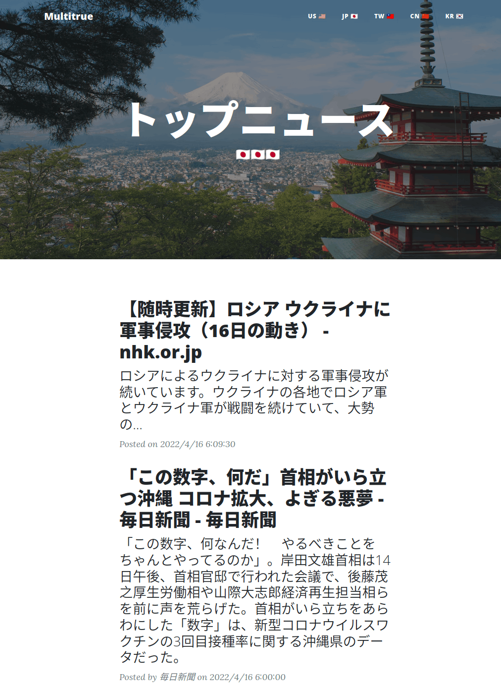
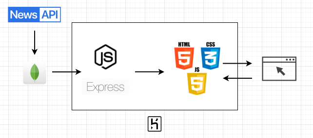
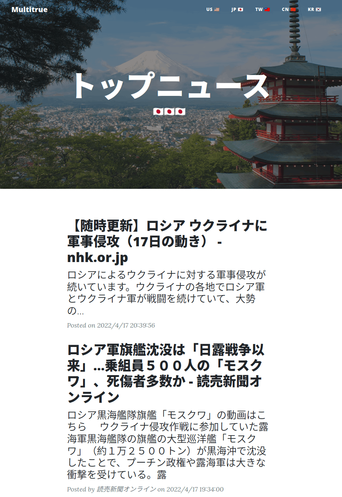

# 目的

筆者自身はトリリンガル（自称）のため、簡単に日本語、英語、中国語などの複数の言語のホットニュースを読めるサービスががあると便利だなとずっと思っていました。「Google Newsで良くない？」って言われそうなところですが、Google Newsはやや使いづらいと感じました。


例えば、
- 言語を切り替えるのに「言語地域→候補から選ぶ→更新」3回クリックする必要がある
- 本当にヘッドライトしか閲覧したくないのに、「おすすめ」や「ピックアップ」などがうるさい
- モバイルのweb版が見づらい・アプリをダウンロードしたくない
- 芸能ニュースにまったく興味がないため、ニュースの表示をカスタマイズしたい

また、やってみないと（何かを残さないと）学んだ技術をすぐ忘れるのはもったいないのも考えて、多言語ニュースWebアプリを自作するという発想に至りました。


## 使った技術

- バックエンド
	- NodeJS
	- Express
- フロントエンド
	- インタラクションがほぼないため、フレームワークは使っておらず、DOMをいじっただけ
	- CSSは[Start Bootstrap](https://startbootstrap.com/)の無料テンプレートを使用
- DB
	- MongoDB
- インフラ
	- Heroku

## コスト

毎月7ドルだけです！！（Heroku Hobbyの料金）

## 成果物

https://www.multitrue.news

https://github.com/aibazhang/multitrue



それでは、詳細を解説していきます。

# 下準備

## ニュースはどこから収集するか
最初はニュース収集するかについてけっこう時間を費やしました。ニュース関連のAPIがかなり多いですが、
- ある程度の無料枠がある
- 多言語のニュースが簡単に取れる
- 使いやすさ

3つの観点から考えて、[NewsAPI](https://newsapi.org/)と[News data](https://newsdata.io/)の2つのAPIに絞りました。ただ、後々[News data](https://newsdata.io/)は言語を指定しても他の言語のニュースが混ざっていることがあると気づいたので（例えば、言語を日本語と指定したにも関わらず、日本関連の英語ニュースが出てくる）、[NewsAPI](https://newsapi.org/)一択となりました。ちなみに、[こちら](https://blog.api.rakuten.net/ja/api-tutorial-news-api-jp/)の記事はNewAPIについて詳しく説明しています。また、RSSなど他の人が作ったニュースAPIを使わないという方法もあるようですが、今回は試していなかったです。

## データベース
ニュース情報を収集するAPIを見つけましたが、ユーザがリクエストを投げるたびに、NewsAPIに叩くのは明らかに現実ではないので、ニュースを保存するDBが必要です。データ量が少ないかつ永久無料枠がベストなので、[MongoDB@Atlas](https://www.mongodb.com/atlas/database)を選びました。AWSとかにいい感じにデポロイしてくれるし、便利です。（無料枠の上限は500MB）また、テーブルはせいぜい1つ、2つくらい、リレーションも特にないはずなので、RDBを使う必要もありませんでした。


## フロントエンド
CSSから実装するはだるいので、Start Bootstrapにある[Clean blog](https://startbootstrap.com/theme/clean-blog)を使わせてもらいました。（感謝）


# 詳細

システム構成はこんな感じです。図を見ていただくとわかると思いますが、特にややこしいことをやっていないです。
- 定期的にNewsAPIからデータと取って、Mongodbに入れます
- ユーザからのリクエストが来る度に、バックエンドでhtml（正確にいうとpug）を作って、レスポンスを返します。いわゆるSSR(Server Side Rendering)ですね。
- コスト面とシンプルさを考えているため、デポロイはHerokuというクラウドプラットフォームサービスを利用しています



### NewsAPIからMongodb
データの定期取得ために、Node.jsのスクリプトを書きました。
NewsAPIの無料枠は100req/dayそして複数の言語のニュースを取得したいといった制約があるので、`cron`を使って一日の取得回数を制限しています。`data-import-config.json`はルートの下にあるデータをインポートする際のconfigファイルです。

[ソース](https://github.com/aibazhang/multitrue/blob/master/src/utils/importData.js)
```javascript
const dotenv = require('dotenv');
const NewsAPI = require('newsapi');
const Cron = require('croner');
const dataImportConfig = require('../../data-import-config.json');
const News = require('../models/newsModel');

dotenv.config({ path: './config.env' });

const newsapi = new NewsAPI(process.env.NEWSAPI_KEY);

async function saveDataToDB(cat, cou) {
  try {
    const { articles } = await newsapi.v2.topHeadlines({
      category: cat,
      country: cou,
      pageSize: dataImportConfig.limit,
    });
    const news = articles.map((a) => ({ country: cou, category: cat, ...a }));
    await News.insertMany(news, { ordered: false });
  } catch (error) {
    if (error.code === 11000) {
      error.writeErrors.forEach((el) => {
        const dubMessage = el.errmsg.match(/({.*?})/)[0];
        console.log(`dup title x category: ${dubMessage}`);
      });
      console.log(`length ${error.writeErrors.length}`);
    }
  }
}

const job = Cron(
  dataImportConfig.cronPattern,
  {
    maxRuns: Infinity,
    timezone: dataImportConfig.timezone,
  },
  () => {
    dataImportConfig.queries.forEach((el) => {
      saveDataToDB(el.category, el.country);
    });
  }
);

module.exports = job;
```

### バックエンド
バックエンドは基本的に定番（？）のMVCの思想に沿って実装しています。

#### Model
まずはmodelです。テーブルNewsだけなので、一つのテーブルで十分です。ちなみに、ORMは`mongoose`を使っています。特に注目していただきたいのは`find`メソッドを実行する前に、**キーワードベースでニュースをフィルタリングする**ミドルウェアを入れました。目的としては、NewAPIの`category`という引数を`general`に設定してニュースを収集すると、あまり読みたくない芸能・スポーツのニュースもけっこうあるので、キーワード（例えば、ニッカンスポーツ）で除きたいです。ルートの下にある`view-config.json`からフィルタリング用のキーワードを追加できます。

[ソース](https://github.com/aibazhang/multitrue/blob/master/src/models/newsModel.js)
```javascript
// .....
newsSchema.pre(/^find/, function (next) {
  const filterKeyword = viewConfig.filterKeyword.map((el) => new RegExp(el));
  this.find({ title: { $not: { $in: filterKeyword } } });
  next();
});
```

#### Controller 

日本語の記事を例にして簡単に説明すると、`country`を`jp`に指定して、DBから日本語の最新ニュースを取ってきます。ページによって言語は異なりますが、ほとんどのところは同じなので、フラグの絵文字、タイトル、国コードなどのメタ情報をレスポンスに追加する必要があります。
expressの詳細の説明は割愛させていただきます。

[ソース](https://github.com/aibazhang/multitrue/blob/master/src/controllers/viewsController.js)
```javascript
exports.getHeadlinesJP = catchAsync(async (req, res) => {
  const news = await News.find({ category: 'general', country: 'jp' })
    .sort('-publishedAt')
    .limit(viewConfig.limit);

  res.status(200).render('index', {
    countryMeta: {
      flag: '🇯🇵',
      title: 'トップニュース',
      code: 'jp',
    },
    news,
  });
});
```

#### View
viewはexpressの`view engine`を使っています。
もちろん最初からcssとhtmlを作成するのはかなり労力がかかるため、先ほど言及した[Clean blog](https://github.com/StartBootstrap/startbootstrap-clean-blog/blob/master/src/pug/index.pug)のpugコード少し今回用に改修してみました。controllerのレスポンスから取っきたメタ情報とニュースの詳細はここで利用されます。

[ソース](https://github.com/aibazhang/multitrue/blob/master/src/views/index.pug)
```pug
extends base

block content
    // Page Header
    header.masthead(style=`background-image: url('assets/img/${countryMeta.code}.avif')`)
        .container.position-relative.px-4.px-lg-5
            .row.gx-4.gx-lg-5.justify-content-center
                .col-md-10.col-lg-8.col-xl-7
                    .site-heading
                        h1= countryMeta.title
                        span.subheading= `${countryMeta.flag.repeat(3)}`
    
    
    if countryMeta.code === 'us'
        #canvas-container
            canvas#canvas.canvas(width="1800", height="400")

    // Main Content
    .container.px-4.px-lg-5
        .row.gx-4.gx-lg-5.justify-content-center
            .col-md-10.col-lg-8.col-xl-7.results
                // Post preview
                each nl in news
                    .post-preview
                        a(href= nl.url, target= "_blank")
                            h2.post-title= nl.title
                            h3.post-subtitle= nl.description
                        if nl.author
                            p.post-meta= `Posted by ${nl.author} on ${nl.publishedAt.toLocaleString('ja-JP', {timeZone: 'Asia/Tokyo'})}`
                        else 
                            p.post-meta= `Posted on ${nl.publishedAt.toLocaleString('ja-JP', {timeZone: 'Asia/Tokyo'})}`
                
                // Divider
                hr.my-4
```

以上、一部のソースをピックアップして説明しました。それでは実際使ってみましょう

## 実際に使ってみよう
https://www.multitrue.news にアクセスします

メニューにある各国のフラグをクリックすると、言語（正確的に言うと国）を切り替えられます
英語のページ（真ん中にあるワードクラウドについては次の記事で説明します）


日本語のページ


詳細を確認したい場合は、タイトルあるいは概要をクリックし、ソースのサイトに飛ぶことができます。


## 改善できそうなところ
- configファイルからニュースをフィルタリングするは不便、人によって除きたいニュースが異なるため、Webページから指定できるようにしたい
- NewAPIに依存しており、いつかNewAPIがダウンすると使えなくなる可能性があるため、RSSや他のAPIを検討してみる必要がある

# 最後に
目的を振り返ってみましょう。

- 言語を切り替えるのに「言語地域→候補から選ぶ→更新」3回クリックする必要がある
	- →メニューから1回だけクリックすれば、簡単に言語を切り替えられる
- 本当にヘッドライトしか閲覧したくないのに、「おすすめ」や「ピックアップ」などがうるさい
	- →ブログ記事を読む感覚でニュースを読むことができました。
- モバイルのweb版が見づらい・アプリをダウンロードしたくない
	- →Webアプリなので、アプリのダウンロードは不要です。
- 芸能ニュースにまったく興味がないため、ニュースの表示をカスタマイズしたい
	- →キーワードベースでニュースをフィルタリングしているので、興味のない芸能・スポーツニューズをある程度除外することができました。

長くなったので、**Herokuにデプロイする方法**、**ワードクラウド機能**についてはまた今度の記事で紹介したいと思います

以上、改善できそうなところはまだけっこうありますが、当初の目的は達成しました。
そして、Zennデビューしました🎉🎉🎉
今後もよろしくお願いいたします。