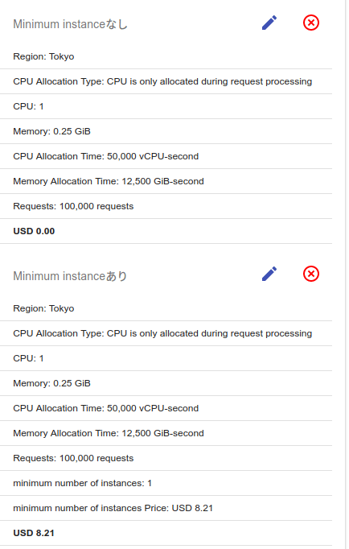

Slack APIはUXのため著名な3秒レスポンスルールを設けています。初期設定のようなものではなく、自ら伸ばすことはできません。（厳しい）

https://api.slack.com/interactivity/slash-commands
> If you need to respond outside of the 3 second window provided by the request responses above, you still have plenty of options for keeping the workflow alive.

Slack Appsを開発したことのある人にとって最初は少し戸惑うでしょうか。（筆者はそうでした。）
最近はCloud Functionsとslack boltで社内の承認アプリを開発していて、試行錯誤した経験を共有したいと思います。

## 経緯

実装する予定のアプリの最初のステップとして、ショートカットでCloud Functionsを発火させてmodalを開きます。`slack bolt`のドキュメントを読んで、以下の実装をおこないました。

https://slack.dev/bolt-python/concepts

（一部のコード）
```python
@app.shortcut("/hogehoge")
def open_application_modal(ack, body: dict, client: WebClient):
    ack()

    result = process()
    client.views_open(
        trigger_id=body["trigger_id"],
        view={
            "type": "modal",
            # View identifier
            "callback_id": "application_form_view",
            "title": {"type": "plain_text", "text": "APP Title"},
            "submit": {"type": "plain_text", "text": "Submit"},
            "blocks": create_blocks(result),
        },
    )

# ....
```

しかし、最初ショートカットをクリックしてmodalが出てこないが、数回試してみたら出てくるという謎な事象が起きていました。modal出てからのステップ（申請フォーマットの提出、Google APIを叩く処理）は正常に動作します。

Cloud Functionsのログを調べてみたら、`expired_trigger_id`が出ているので、トリガーの有効期限が切れて、3秒レスポンスルールを違反しているようです。
```
The server responded with: {'ok': False, 'error': 'expired_trigger_id'})

Traceback (most recent call last): File "/layers/google.python.pip/pip/lib/python3.9/site-packages/slack_bolt/listener/thread_runner.py", line 65, in run returned_value = listener.run_ack_function( File "/layers/google.python.pip/pip/lib/python3.9/site-packages/slack_bolt/listener/custom_listener.py", line 50, in run_ack_function return self.ack_function( File "/workspace/src/app.py", line 68, in open_application_modal client.views_open( File "/layers/google.python.pip/pip/lib/python3.9/site-packages/slack_sdk/web/client.py", line 4333, in views_open return self.api_call("views.open", json=kwargs) File "/layers/google.python.pip/pip/lib/python3.9/site-packages/slack_sdk/web/base_client.py", line 160, in api_call return self._sync_send(api_url=api_url, req_args=req_args) File "/layers/google.python.pip/pip/lib/python3.9/site-packages/slack_sdk/web/base_client.py", line 197, in _sync_send return self._urllib_api_call( File "/layers/google.python.pip/pip/lib/python3.9/site-packages/slack_sdk/web/base_client.py", line 331, in _urllib_api_call return SlackResponse( File "/layers/google.python.pip/pip/lib/python3.9/site-packages/slack_sdk/web/slack_response.py", line 205, in validate raise e.SlackApiError(message=msg, response=self) slack_sdk.errors.SlackApiError: The request to the Slack API failed. (url: https://www.slack.com/api/views.open
```

数年前の英語記事・GCPのドキュメントを調べてみたところ、Pub/Subによって非同期処理を実装すると3秒レスポンス問題を解決できるようです。
https://dev.to/googlecloud/getting-around-api-timeouts-with-cloud-functions-and-cloud-pub-sub-47o3

https://cloud.google.com/functions/docs/tutorials/slack#functions-clone-sample-repository-python

最近Slack SDKがかなり進化して、非同期処理なども対応してくれているので、複数のCloud Functionsまで使う必要がなさそうです。


## 試み1 非同期処理に変更

ドキュメントはpythonにおいてasyncの使用方法を記載しています。

https://slack.dev/bolt-python/concepts#async

これだけでは理解できないので、

https://github.com/slackapi/bolt-python/blob/main/examples/readme_async_app.py

の例を参照しながら、実装を非同期処理に変えました。

```python
@app.shortcut("/hogehoge")
async def open_application_modal(ack, body: dict, client: WebClient):
    await ack()

    result = process()
    client.views_open(
        trigger_id=body["trigger_id"],
        view={
            "type": "modal",
            # View identifier
            "callback_id": "application_form_view",
            "title": {"type": "plain_text", "text": "APP Title"},
            "submit": {"type": "plain_text", "text": "Submit"},
            "blocks": create_blocks(result),
        },
    )

# ....
```

しかし、再度デプロイしてショートカットを使ってみると何も変わりません。最初と同じく`{'ok': False, 'error': 'expired_trigger_id'})`が出てきます。

## 試み2 ローディングを追加

`slackapi/node-slack-sdk`のissusを確認したら、同じ問題に困っていた方がいました。

https://github.com/slackapi/node-slack-sdk/issues/1131

modalをそのまま出すではなく、先にローディングの画面を返すといった方法もあるようです。Pythonで同じようなことしたら、失敗しました。ローディングが出る前に`{'ok': False, 'error': 'expired_trigger_id'})`吐き出されました。

## 試み3 Lazy listener

Slack SDKの開発者Kazuhiro Seraさんからいただいたコメントを見て、

> lazy listener という仕組みで楽に対応できる

らしいです。

https://twitter.com/seratch_ja/status/1532845339484749824?s=20&t=3CnW1-sD9CE6RdJIpaT28A

> Lazy Listeners are a feature which make it easier to deploy Slack apps to FaaS (Function-as-a-Service) environments.

この機能はFaaS環境のデプロイをよりスムーズにできるために実装されたようです。
また、現時点Pythonのみの機能（他の言語には実装する予定もないらしい）です。

Lazy Linstenersを利用すれば流石にうまくいけるじゃないかと思いながら、早速試してみました。
気をつけるすべきポイントとしては、lazy listenerを利用とdecoratorは使えなくなり、書き方を少し変える必要があります。

```python
def shortcut(body, ack, logger):
    logger.info(body)

def open_application_modal(body: dict, client: WebClient):

    result = process()
    client.views_open(
        trigger_id=body["trigger_id"],
        view={
            "type": "modal",
            # View identifier
            "callback_id": "application_form_view",
            "title": {"type": "plain_text", "text": "APP Title"},
            "submit": {"type": "plain_text", "text": "Submit"},
            "blocks": create_blocks(result),
        },
    )

app.shortcut("/hogehoge")(
    ack=ack_shortcut,
    lazy=[open_application_modal]
)

# ....
```

残念ながら、うまくいきません。`{'ok': False, 'error': 'expired_trigger_id'})`（4回目）

ここまで来たら、何かおかしいぞと気づいきました。
GCPのサービスアカウントの認証などもあるので、そもそも処理`process()`が重いのでなく、Clouds Functionの起動自体が重い疑惑が浮上しました。Clouds Functionのドキュメントから
起動時間を短縮できる`--min-instances`というオプションを見つけました。

## Minimum instance

通常の場合、Cloud Functionsが発火された後、数秒間アイドリング（初期設定）が設けられています。寒い冬に数分間アイドリングして車のエンジンを暖めてから走り始めるのと同じような仕組みですね。`--min-instances`を設定すると、アイドリング済みの状態を保って、いつでも走れる状態を維持します。

> minimum number of container instances to be kept warm and ready to serve requests

Minimum instanceの数はコンテナインスタンスの数です。使用頻度によって設定すれば良いでしょうか。

「ずっとインスタンス起動させないといけないのであれば、サーバレスの意味なくない？料金はどうなるだろう」と思いながら、ドキュメントを調べました。

常に割り当てるのではなく、コンテナを常にアイドル済みの状態を保持してくれているので、その都度費用が発生するらしいです。CPU is always allocatedとの違いがよく理解できなかったので、GCPの人に問い合わせしてみたら、

> 現在は最小インスタンス（Cloud Functionsの話）を設定したからといってCPU is always allocated（Cloud Runの話） になるような仕様はない

という返答をいただきました。やはりアイドリングの時間だけが課金されるので、安心しました。
`--min-instances 1`を設定して料金をシュミュレーションしてみると、通常の場合より1ヶ月8.21ドルかかるっぽいです。




実際にオプション`--min-instances 1`を追加してデプロイすると、slackからショートカットをクリックしてmodalがすぐ出てきました。ログを確認すると`{'ok': False, 'error': 'expired_trigger_id'})`というエラーも消えました。
これでやっと本当の原因にたどり着きました。

## 感想

ログを確認する際に、エラーだけでなくその前後の内容も合わせて確認したほうがいいという教訓を得ました。とはいえ、自分のミスのおかげで、Slack boltとCloud Functionsの理解を深めました。
試行錯誤しながら、遠回りしながら、好奇心が満たされる感じが最高でした。