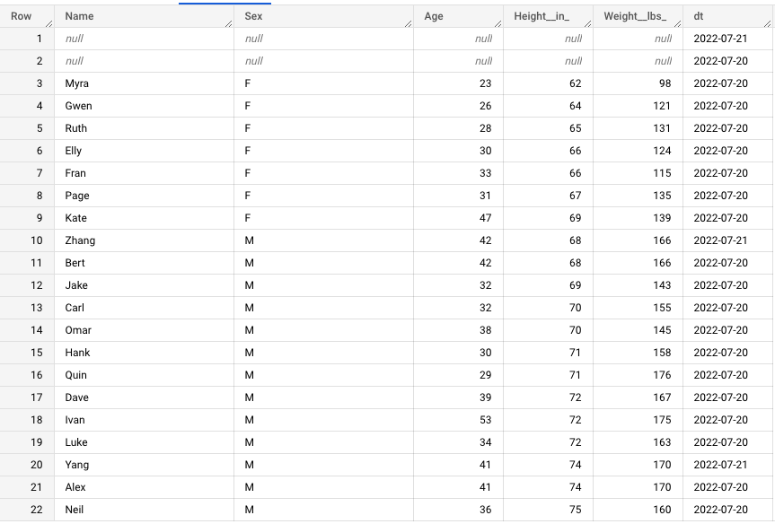

## GCS外部パーティションテーブルをBigQueryに取り込む

BigQueryでデータレイクを構築する際に、GCS、Google Drive Data、Bigtableから外部テーブルを取り組む場面は少なくないと思います。下記のような外部テーブルがパーティションで分けられている場合(Hive partitioned dataと呼ばれている)は少しややこしくなりますが、

```console
gs://myBucket/myTable/dt=2019-10-31/lang=en/foo
gs://myBucket/myTable/dt=2018-10-31/lang=fr/bar
```

公式ドキュメントは取り組み方をわかりやすくまとめてくれています。`bq`というcliでコマンド2行で解決できます。

https://cloud.google.com/bigquery/docs/hive-partitioned-queries-gcs#partition_schema_detection_modes

1. テーブル定義を作成
```bash
bq mkdef \
  --autodetect \
  --source_format=CSV \
  --hive_partitioning_mode=AUTO \
  --hive_partitioning_source_uri_prefix=gs://your-bucket/your-table/ \
  "gs://you-bucket/you-table/*.csv" > /tmp/MyTableDefFile

```

2. テーブルを作成

```bash
bq mk --external_table_definition=/tmp/MyTableDefFile \
  my_dataset.my_table
```

## Airflowで取り込むとどうなる？

まず、簡単に背景を補足すると現在筆者が構築しているデータ基盤はCloud Composer (Airflow)でワークフローを管理しており、AirflowでGCSから外部テーブルを取り込むといった需要があります。パーティションではない普通のテーブルであれば、`BigQueryCreateExternalTableOperator`利用すると一発で解決できます。
しかし、パーティションのある場合はAirflowから事前用意された関数がなく（2022年7月時点）、他の方法を考えないといけないです。

GCP公式ドキュメントもConosole, bq, API, Java 4つの方法しか書いておらず、PythonのSDKはまだ実装されていないようです。
https://cloud.google.com/bigquery/docs/hive-partitioned-queries-gcs#creating_an_external_table_for_hive_partitioned_data


## `BigQueryInsertJobOperator`を利用

いろいろ調査した結果、筆者と同じことに困っている人がいたようです。

https://github.com/apache/airflow/issues/13626

その下に
> Have you tried to use BigQueryInsertJobOperator? for example, see: #13598

「`BigQueryInsertJobOperator`を使ってみたらどう？」というコメントがありました。
さらにリンク先のPR（なぜかクローズされた）に行くと、`BigQueryInsertJobOperator`の例をまとめてもらっています。どうやら専用のSDKがない場合`BigQueryInsertJobOperator`を使うのは普通らしいです。引数もやや雑で、そのままBigQueryのREST APIに叩くのと近い感じです。

https://airflow.apache.org/docs/apache-airflow-providers-google/stable/_api/airflow/providers/google/cloud/operators/bigquery/index.html#airflow.providers.google.cloud.operators.bigquery.BigQueryInsertJobOperator

https://github.com/apache/airflow/pull/13598/files

しかしながら、上記のPRは外部パーティションテーブルを取り組む例がなかったため、BigQuery APIのドキュメントを調べて、`hivePartitioningOptions`というオプションを見つけました。これを追加すると、もしかしてうまくいくのではないかと思い、早速検証してみました。

https://cloud.google.com/bigquery/docs/reference/rest/v2/tables#hivepartitioningoptions

### データを用意

https://people.math.sc.edu/Burkardt/datasets/csv/csv.html
から適当にcsvファイルをダウロードします。

biostats1.csv
```
"Name",     "Sex", "Age", "Height (in)", "Weight (lbs)"
"Alex",       "M",   41,       74,      170
"Bert",       "M",   42,       68,      166
"Carl",       "M",   32,       70,      155
"Dave",       "M",   39,       72,      167
"Elly",       "F",   30,       66,      124
"Fran",       "F",   33,       66,      115
"Gwen",       "F",   26,       64,      121
"Hank",       "M",   30,       71,      158
"Ivan",       "M",   53,       72,      175
"Jake",       "M",   32,       69,      143
"Kate",       "F",   47,       69,      139
"Luke",       "M",   34,       72,      163
"Myra",       "F",   23,       62,       98
"Neil",       "M",   36,       75,      160
"Omar",       "M",   38,       70,      145
"Page",       "F",   31,       67,      135
"Quin",       "M",   29,       71,      176
"Ruth",       "F",   28,       65,      131
```

biostats1.csvを少しいじって疑似パーティションbiostats2.csvを作成します

biostats2.csv
```
"Name",     "Sex", "Age", "Height (in)", "Weight (lbs)"
"Yang",       "M",   41,       74,      170
"Zhang",       "M",   42,       68,      166
```

データをGCSにコピーします

```console
gsutil cp biostats1.csv gs://my-bucket/biostats/dt=2022-07-21/
gsutil cp biostats2.csv gs://my-bucket/biostats/dt=2022-07-21/
```

### 簡易なAirflow DAGを作成

directory構造は
```
gs://my-bucket/dt=2022-07-20/biostats1.csv
gs://my-bucket/dt=2022-07-21/biostats2.csv
```
になっているため、BigQuery APIのドキュメントを読んだ結果、以下のHive Partitioning設定を`BigQueryInsertJobOperator`の`configuration`に追加するとよいですね。

```
"hivePartitioningOptions": {
    "mode": "AUTO",
    "sourceUriPrefix": "gs://my-bucket/biostats/",
},
```

コードは最終的にこんな感じになりました。
- `sourceUris`は`gs://my-bucket/biostats/*.csv`まで指定すれば良い
- `mode`を`AUTO`に設定したら、パーティションキーは自動検出できる

```python
from datetime import datetime, timedelta
import pendulum
from airflow import DAG
from airflow.providers.google.cloud.operators.bigquery import BigQueryInsertJobOperator

PROJECT_ID = "my_project"
DATASET_NAME = "my_dataset"
TABLE = "biostats"

with DAG(
    "test_hive_partitioned",
    default_args={
        "owner": "airflow",
        "start_date": pendulum.timezone("Asia/Tokyo").convert(datetime(2022, 1, 2)),
        "depends_on_past": False,
        "retries": 0,
        "retry_delay": timedelta(minutes=5),
        "tzinfo": pendulum.timezone("Asia/Tokyo"),
    },
    description="Load hive partitioned external table",
    catchup=False,
) as dag:
    load_table = BigQueryInsertJobOperator(
        task_id="load_from_gcs_job",
        configuration={
            "load": {
                "destinationTable": {
                    "projectId": PROJECT_ID,
                    "datasetId": DATASET_NAME,
                    "tableId": TABLE,
                },
                "sourceUris": ["gs://my-bucket/biostats/*.csv"],
                "autodetect": True,
                "sourceFormat": "CSV",
                "hivePartitioningOptions": {
                    "mode": "AUTO",
                    "sourceUriPrefix": "gs://my-bucket/biostats/",
                },
            }
        },
    )

    load_table
```

### 実行結果

ローカルで構築したAirflow環境で上記DAGを実行して、Consoleから確認すると、テーブルがちゃんとありました。`dt`というもともと存在しなかった日付を表す列（パーティションキー）も新しく追加されました。
日付というパーティションキがあると、ETL処理を行う際にべき等性の担保や日付を指定した洗い替え処理は非常に楽になります。



以上、AirflowでGCS外部パーティションテーブルをBigQueryに取り込む方法でした
