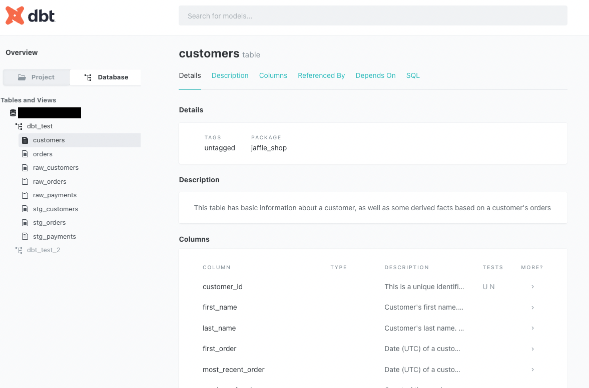

データ基盤におけるETL/ELT開発のT(Transform)を担うツール[dbt](https://www.getdbt.com/)は最近注目を浴びています。dbtでデータモデリングする方法既に多く紹介されたので、この記事では手を動かしながらdbtでBigQuery上に構築したデータ基盤のメタデータを管理する方法を紹介します。


## 環境構築


dbt公式は`Homebrew`を推していますが、ローカル環境が汚染されるのをなるべく避けたいので、Dockerで環境構築します。
dbtのプロジェクトとプロファイルの設定ファイルを用意しておかないと、公式のドキュメントそのまま実行したらコケます。しかし設定ファイルの生成は環境を構築する必要があるので無限ループになっています。

https://docs.getdbt.com/docs/get-started/docker-install

そのため、公式のサンプルプロジェクトをforkし、事前にローカル環境で生成した設定ファイルを追加しました。

https://github.com/aibazhang/dbt-metadata-management

### `profiles.yml`を編集

`{YOUR_DATASET_NAME}`と`{YOUR_PROJECT_ID}`を置き換えます。
複数のデータセットのメタデータも作成可能ですが、一旦任意のデータセット名を指定する必要があります。dbtの問題点でもありますが、後ほど説明します。

### Dockerイメージをプル

```console
docker pull ghcr.io/dbt-labs/dbt-bigquery:1.2.0
```

### コンテナを立ち上げる

```console
git clone https://github.com/aibazhang/dbt-metadata-management
cd dbt-metadata-management
```

### `gcloud`認証

認証済みの場合、このステップは不要です。

```console
gcloud auth login --no-launch-browser
gcloud auth application-default login --no-launch-browser
```

### コンテナを立ち上げる

```console
docker run --rm \
  --network=host \
  --platform linux/amd64 \
  --mount type=bind,source=`PWD`,target=/usr/app \
  --mount type=bind,source=`PWD`/profiles.yml,target=/root/.dbt/profiles.yml \
  --mount type=bind,source=$HOME/.config/gcloud/application_default_credentials.json,target=/root/.config/gcloud/application_default_credentials.json \
  ghcr.io/dbt-labs/dbt-bigquery:1.2.0 \
  ls
```

データモデルのリストが表示されたら、環境構築が無事終了です。

## ドキュメントを生成する

### `docs generate`

以下のコマンドを実行すれば、`models/`配下のクエリとメタデータ（yamlファイル）を参照して、`target/`配下にメタデータのドキュメントが生成されます。

```console
docker run --rm \
  --network=host \
  --platform linux/amd64 \
  --mount type=bind,source=`PWD`,target=/usr/app \
  --mount type=bind,source=`PWD`/profiles.yml,target=/root/.dbt/profiles.yml \
  --mount type=bind,source=$HOME/.config/gcloud/application_default_credentials.json,target=/root/.config/gcloud/application_default_credentials.json \
  ghcr.io/dbt-labs/dbt-bigquery:1.2.0 \
  docs generate
```

さらに`dbt docs serve`を実行すると、localhostからメタデータのドキュメントを確認できます↓。schema `dbt_test`と`dbt_test_2`はBigQueryのデータセットに該当します。



### 静的htmlファイルを生成

`target/manifest.json`と`target/catalog.json`は直接`html`にインサートされないので、ドキュメントを確認するたびに`dbt docs serve`でサーバを立ち上げるという面倒な作業が発生します。
調べてみたら、同じ問題に困っている方はすでにissueを投げました。
https://github.com/dbt-labs/dbt-docs/issues/53
回答にあるPythonスクリプトをそのまま使って、静的htmlファイルを生成します。

https://github.com/aibazhang/dbt-metadata-management/blob/main/generate_static_html.py

```console
python generate_static_html.py
```

生成された`target/index2.html`は静的htmlファイルのため、サーバを立ち上げることなく、GCSあるいはS3とかでホストすれば、簡単かつ低コストでメタデータのドキュメントを共有できます。

## 問題点

### 複数のデータセットがある場合

先ほど環境構築の節で言及しましたが、複数のデータセットがある場合は少し手間がかかります。
幸い`macro`を編集すれば対処できます。

https://github.com/aibazhang/dbt-metadata-management/blob/main/macros/get_custom_schema.sql

データモデルのconfigにschema（＝BigQueryのデータセット）を追加すれば複数データセットが表示できるようになります。

https://github.com/aibazhang/dbt-metadata-management/blob/main/models/dbt_test_2/sample_table.sql

### 異なるデータセットにある同名テーブルの扱い方

しかし、異なるデータセットにある同名テーブルがある場合、ドキュメントを生成すると下記のエラーが出ます。

```console
dbt.exceptions.CompilationException: Compilation Error
  dbt found two models with the name "orders".
  
  Since these resources have the same name, dbt will be unable to find the correct resource
  when looking for ref("orders").
  
  To fix this, change the name of one of these resources:
  - model.jaffle_shop.orders (models/dbt_test_2/orders.sql)
  - model.jaffle_shop.orders (models/orders.sql)
```

https://discourse.getdbt.com/t/is-it-possible-to-have-multiple-files-with-the-same-name-in-dbt/647/2

一応回避できるようですが、モデル名を変えられており、BigQuery上のテーブルと1対1でなくなるため、良い方法とは言えません。


このissueにて熱く議論されているが、現時点(2022.12.11)はまだ対応されていないようです。
https://github.com/dbt-labs/dbt-core/issues/1269


## まとめ

異なるデータセットにある同名テーブルをどう扱うといった問題がありつつも、dbtでBigQuery上に構築したデータ基盤のメタデータを簡単かつ低コスト管理できます。
以上です。ご参考になれば幸いです。
