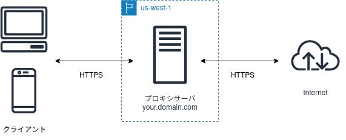
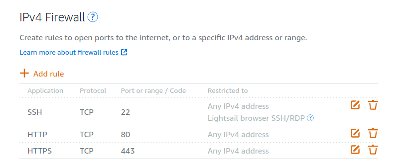
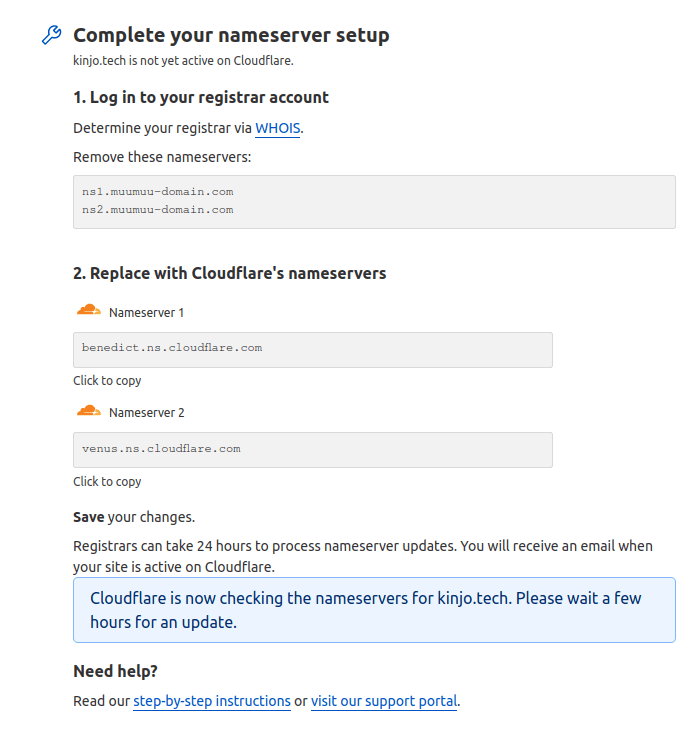
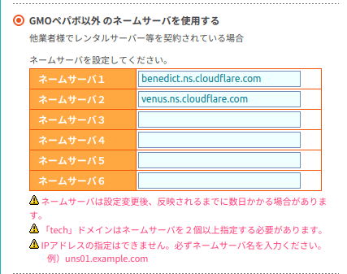
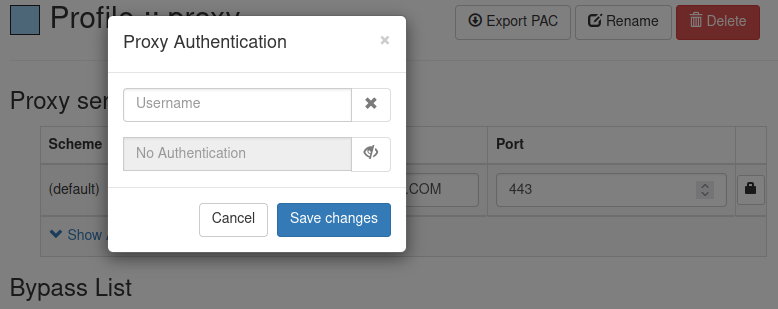
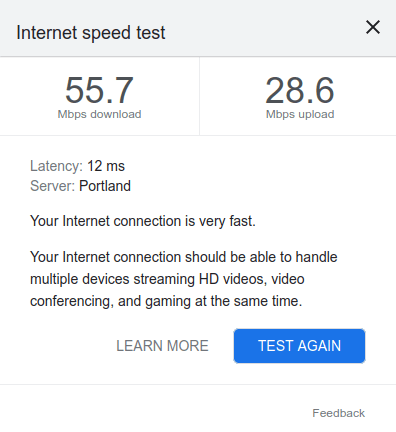

**本記事に書かれていることを実践する際は自己責任でお願いします。不都合などが生じた場合、責任を負いかねます。**

## 背景

日本のインターネット環境は比較的自由ですが、海外のサービスを利用際には大人の諸事情によってサイトがリダイレクトされて利用できない場合があります。
制限されるのはあまり気持ちよく感じないのとWeb閲覧時自分のプライバシーを保護するため、
先日自作プロキシサーバを自作しました。

本記事では主にHowに焦点を当てて紹介します。関連技術のWhatとWhyについては深く言及しないので、公式ドキュメントまたは他の解説記事をご参照ください。

雑なアーキテクチャ図



## 利用技術・サービス

- [AWS Lightsail](https://aws.amazon.com/jp/lightsail/)
	- 仮想プライベートサーバ
	- 3ヶ月無料
	- $3.5/月
- [ムームードメイン](https://muumuu-domain.com/)
	- 3000~4000円/年（申請するドメインによる）
- [gost](https://github.com/ginuerzh/gost/blob/master/README_en.md)
	- OSS
	- Webサービスを装うために使う
- [Cloudflare](https://www.cloudflare.com/)
	- gostを使うのに必要
	- 無料プランで十分
- [SwitchyOmega](https://github.com/FelisCatus/SwitchyOmega)
	- OSS
	- クライアント側の設定

あくまでも一例で最適解ではないです。


## 事前準備

### VPS（仮想プライベートサーバ）を契約

今回は、AWSが提供しているLightsailという軽量仮想プライベートサーバのサービスを利用しますが、EC2やHerokuなど他のサービスを利用する場合もまったく問題ありません。リージョンは日本以外（例えばUS）に設定しておきます。AWSのCLIを利用する場合、AWS IAMなどを設定する必要がありますが、今回は基本的にいじらなくても良いです。
Lightsailでサーバを立ち上げたら、AWS CloudShellからサーバにアクセスできます。ローカルに慣れている方はキーをダウンロードして、`ssh`でアクセスしても構いません。

念のため、
```
curl ipinfo.io
```
を実行して、設定しているリージョンの住所と一致しているか確認します。
また、HTTPSを利用するため、`Networking -> IPv4 Firewall`からHTTPSを追加しておきます。



### ドメインを取得

昨今の円安の影響で海外のドメインレジスターサービス（例えばGoDaddy）がかなり高くなっているため、国内サービス[ムームードメイン](https://muumuu-domain.com/)を利用してドメインを取得しました。

### Cloudflareアカウントを作成

WebサービスでもないなのになぜわざわざCloudflare使う理由
簡単に言えば、VPSのIPがブロックされる可能性はゼロではないのとプロバイダ側にIPアドレスを変更してくれないケースが多いためです。CloudflareなどのCDNサービスを挟むことでわずかな遅延が発生するかもしれませんが、可用性を向上させることができます。また、Cloudflareは無料枠を提供しており、WebSocketプロトコル (gostを使うのに必要なもの)に対応しているため、今回ユースケースに適しています。

ログインした後ガイダンスにしたがってネームサーバを設定します。


続いて、ムームードメインからデアフォルトのネームサーバを変更します。
詳細は[ネームサーバのセットアップ方法（GMOペパボ以外のサービス）](https://support.muumuu-domain.com/hc/ja/articles/360047097273)にご参照ください。



最後はサブドメインのレコードを追加して、立ち上げたサーバのIPアドレスと紐付けます。
IPv4 FirewallにHTTPSを追加しておかないと動かないので気をつけてください。
https://developers.cloudflare.com/dns/manage-dns-records/how-to/create-subdomain/

事前準備が完了したので、いよいよサーバ側を設定を始めます。

## サーバ側の設定

### Dockerエンジンをインストール

[Docker公式ドキュメント](https://docs.docker.com/engine/install/ubuntu/#install-using-the-repository)を参考にしてDockerエンジンをインストールします。

```shell
# Add Docker's official GPG key:
sudo apt-get update
sudo apt-get install ca-certificates curl gnupg
sudo install -m 0755 -d /etc/apt/keyrings
curl -fsSL https://download.docker.com/linux/ubuntu/gpg | sudo gpg --dearmor -o /etc/apt/keyrings/docker.gpg
sudo chmod a+r /etc/apt/keyrings/docker.gpg

# Add the repository to Apt sources:
echo \
  "deb [arch="$(dpkg --print-architecture)" signed-by=/etc/apt/keyrings/docker.gpg] https://download.docker.com/linux/ubuntu \
  "$(. /etc/os-release && echo "$VERSION_CODENAME")" stable" | \
  sudo tee /etc/apt/sources.list.d/docker.list > /dev/null
sudo apt-get update

sudo apt-get install docker-ce docker-ce-cli containerd.io docker-buildx-plugin docker-compose-plugin
```

### TCP BBR (Bottleneck Bandwidth and Round-trip propagation time)をオンにする

TCP BBRはGoogleが開発した輻輳制御アルゴリズムで、TCP通信の高速化を実現できます。詳細は下記の記事にご参照ください。

https://qiita.com/fallout/items/92b2099ab5e16cfeb1f9

Linuxカーネルにすでに標準搭載されているため、起動するだけで利用できます。
```shell
sudo modprobe tcp_bbr
echo "tcp_bbr" | sudo tee --append /etc/modules-load.d/modules.conf
echo "net.core.default_qdisc=fq" | sudo tee --append /etc/sysctl.conf
echo "net.ipv4.tcp_congestion_control=bbr" | sudo tee --append /etc/sysctl.conf
sudo sysctl -p
```

`lsmod | grep bbr`を実行して`tcp_bbr`が出ていれば、設定が完了しました。

### 証明書を発行

HTTPS通信を利用するため、証明書の発行は不可欠です。あえて先日日経クロステックで風評被害を受けた[let's encrypt](https://letsencrypt.org/)を使います。

Ubuntuのインストール手順は公式ドキュメントにわかりやすくまとめられています。
https://certbot.eff.org/instructions?ws=webproduct&os=ubuntufocal

下記のコマンドを実行すると証明書が生成されます。
```shell
sudo certbot certonly --standalone
```
だたし、証明書の有効期限は90日のため、`certbot renew --force-renewal`をcrontabに追加して定期実行するのをおすすめします。

### gostでHTTPSサービスを立ち上げる

[gost](https://github.com/ginuerzh/gost/blob/master/README_en.md)を利用してWebサービスを立ち上げます（正確的にいうとWebサービスを装う）
クライントとプロキシサーバ間の通信もHTTPSを利用するメリットは、普通のトラフィックと混同させることで第三者による識別されるリスクを軽減します。

以下3つ必要な変数を設定しておくと、一行のDockerコマンドでサービスを立ち上げることができます

- `DOMAIN` 先程Cloudflareで追加したサブドメインのレコード
- `USER` 自ら設定する項目（クライアントからの利用時にも必要）
- `PASS` 自ら設定する項目（クライアントからの利用時にも必要）

```shell
DOMAIN="SUBDOMAIN.DOMAIN.COM"
USER="USERNAME"
PASS="PASSWORD"

PORT=443
AUTH=$(echo -n ${USER}:${PASS} | base64)
BIND_IP=0.0.0.0
CERT_DIR=/etc/letsencrypt
CERT=${CERT_DIR}/live/${DOMAIN}/fullchain.pem
KEY=${CERT_DIR}/live/${DOMAIN}/privkey.pem
sudo docker run -d --name gost \
    -v ${CERT_DIR}:${CERT_DIR}:ro \
    --net=host ginuerzh/gost \
    -L "http2://${BIND_IP}:${PORT}?auth=${AUTH}&cert=${CERT}&key=${KEY}"
```

上記の設定が正しく行われていればサーバ側の設定がこれで完了です。
最後に、ローカルPCからcurlを実行して返された住所がLightsailリージョンの住所になっているかを確認します。例えばus-west-1の場合は`Boardman, Oregon, US`になります。
```shell
DOMAIN="SUBDOMAIN.DOMAIN.COM"
USER="USERNAME"
PASS="PASSWORD"
curl -v "https://ipinfo.io" --proxy "https://${DOMAIN}" --proxy-user '${USER}:${PASS}'
```


## クライアント側の設定

PCブラウザからアクセスする場合、[SwitchyOmega](https://chrome.google.com/webstore/detail/proxy-switchyomega/padekgcemlokbadohgkifijomclgjgif)というアドオン(ChromeとFirefox両方に対応)を使えば簡単に設定できます。さらに特定サイトのみプロキシ経由でアクセスすることも可能です。
https://qiita.com/zakisanf05/items/acaf0b27bdf614a8cf44

SwitchyOmegaをインストールした後、先ほど設定したドメイン、ユーザネーム、パスワードをセットします。




一方、PCのグローバル設定あるいはモバイルから利用する場合、[clash](https://github.com/Dreamacro/clash)を使用することをおすすめします。設定がやや複雑になりますが、プロキシチェーンやfake-ipなどより高度な機能を利用できます。

https://dreamacro.github.io/clash/

## 試してみよう

最初に思い浮かんだ例はnba.comです。
そのままアクセスするとスポーツニュースサイトにリダイレクトされます。(2023年10月時点)


構築したプロキシサーバを経由してアクセスすると・・・

リダイレクトされずnbaの公式サイトにアクセスできました。

スピードもプロキシサーバ経由しない場合とほぼ変わらずでした。（TCP BBRアルゴリズムとCloudflareの力か？）


## 参考URL

- [GoogleのTCP BBRでTCPを高速化しProxyもその恩恵にあずかる](https://qiita.com/fallout/items/92b2099ab5e16cfeb1f9)
- [Chromeで特定サイトのみプロキシ経由でアクセスする拡張機能Proxy SwitchyOmega](https://qiita.com/zakisanf05/items/acaf0b27bdf614a8cf44)
- [haoel.github.io](https://github.com/haoel/haoel.github.io/blob/master/scripts/install.ubuntu.18.04.sh)
